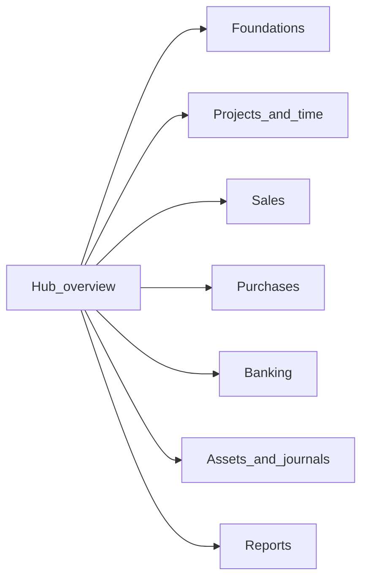

# FreeAgent API entity map

This is an **unofficial reconstruction** of how FreeAgent API resources link to each other. FreeAgent does not publish an entity-relationship diagram; the graphs here are inferred from [official API documentation](https://dev.freeagent.com/docs) — attribute tables where kind is **URI**, nested child resources, and list filters that take a resource URI (`?contact=`, `?project=`, and so on).

Use this map to understand object relationships when integrating with FreeAgent, and to choose a sensible order when adding resources to the SDK. For what the SDK implements today, see [API coverage](../reference/api-coverage.md).

## How to read the diagrams

| Line style | Meaning |
|------------|---------|
| Solid arrow (`-->`) | Documented **required** URI on create, or a list endpoint that requires a parent URI (for example bank transactions require `bank_account`) |
| Dashed arrow (`-.->`) | Optional URI, nested line-item URI, or a link that appears **after** the record exists (for example `rebilled_on_invoice`, `billed_on_invoice`) |

Edge labels use the **wire field name** from the API (`contact`, `paid_invoice`, `project`, and so on).

**Caveats:**

- Optional URIs may be absent on any given record.
- Some links apply only to certain company types (for example `property` on `UkUnincorporatedLandlord` companies).
- Nested line items (invoice items, bill items) are documented on the parent resource page unless they have their own docs URL (estimate items do).
- `Currencies` are ISO codes on resources, not URI references to a `/currencies` resource.
- The [Accountancy Practice API](https://dev.freeagent.com/docs/accountancy_practice_api) is a separate product surface and is not mapped here.

## Cluster overview

Resources are grouped into clusters so no single diagram becomes unreadable. Each cluster has its own page with a focused diagram and a resource catalogue.

| Cluster | Page | What it covers |
|---------|------|----------------|
| Foundations | [Foundations](api-entity-map/foundations.md) | Company, contacts, users, categories |
| Projects and time | [Projects and time](api-entity-map/projects-and-time.md) | Projects, tasks, timeslips, notes |
| Sales | [Sales](api-entity-map/sales.md) | Invoices, estimates, recurring invoices, credit notes, stock items |
| Purchases | [Purchases](api-entity-map/purchases.md) | Bills, expenses, hire purchases, attachments |
| Banking | [Banking](api-entity-map/banking.md) | Bank accounts, transactions, explanations, feeds |
| Assets and journals | [Assets and journals](api-entity-map/assets-and-journals.md) | Capital assets, journal sets, properties, payroll |
| Reports | [Reports](api-entity-map/reports.md) | P&amp;L, balance sheet, trial balance, tax returns — weak URI graphs |

## Using this map to sequence SDK work

Layers describe **dependency pressure**, not a mandatory backlog. A resource in a later layer can still be implemented first if its only upstream links are optional URIs you are willing to pass as opaque strings until typed services exist.

| Layer | Resources | Rationale |
|-------|-----------|-----------|
| **0 — Done** | Company, Contacts, Categories, OAuth helpers | Company context, contacts, and chart-of-accounts categories are referenced almost everywhere |
| **1 — Cheap hubs** | Users | Few remaining foundation dependencies; users are required for expenses and timeslips |
| **2 — Project spine** | Projects, Tasks | Projects require `contact` (done); tasks require `project`; timeslips require `task`, `project`, and `user` |
| **3 — Sales documents** | Invoices, Estimates, Recurring invoices, Credit notes | Invoices require only `contact` on create; `project`, `bank_account`, and item `category` URIs are optional |
| **4 — Purchases** | Bills, Expenses | Bills require `contact`; expenses require `user` and `category` |
| **5 — Banking** | Bank accounts, Bank transactions, Bank transaction explanations | Explanations link back to invoices, bills, contacts, projects, users, and stock |
| **6 — Assets and books** | Capital assets, Journal sets, Properties, Payroll | Heavier accounting surface; properties are landlord-only |
| **7 — Reports** | P&amp;L, Balance sheet, Trial balance, VAT returns, and similar | Mostly date-bounded reads with few URI dependencies |

### Is Invoices blocked?

**No.** The only required URI when creating an invoice is `contact`, which the SDK already implements. Optional URIs (`project`, `bank_account`, `property`, `recurring_invoice`) and invoice-item `stock_item` can remain opaque URI strings until those services are added. Invoice-item `category` URIs can already resolve through the Categories service.

Resources that are **nice to have nearby** (before or shortly after invoices), depending on how deeply you want sample probes and typed models to resolve links:

| Resource | Why it sits near invoices |
|----------|--------------------------|
| **Categories** | Implemented. Invoice, estimate, and bill line items reference categories |
| **Bank accounts** | Invoice remittance via `bank_account`; later needed for bank explanations with `paid_invoice` |
| **Projects** | Optional on invoices; required for tasks and timeslips |
| **Users** | Not needed for invoices; required for timeslips and expenses |

Implement **after** invoices if you care about end-to-end flows: credit note reconciliations, estimate-to-invoice conversion, timeslip `billed_on_invoice`, expense or bill `rebilled_on_invoice`, and bank explanation `paid_invoice`.

When you add or retrofit an SDK endpoint, check the relevant cluster page and update it if the official docs expose a URI link not yet shown.

## Related documentation

- [API coverage](../reference/api-coverage.md) — implemented SDK resources
- [Implementing endpoints](../../plan/IMPLEMENTING_ENDPOINTS.md) — contributor checklist
- [FreeAgent API documentation](https://dev.freeagent.com/docs) — authoritative contract
