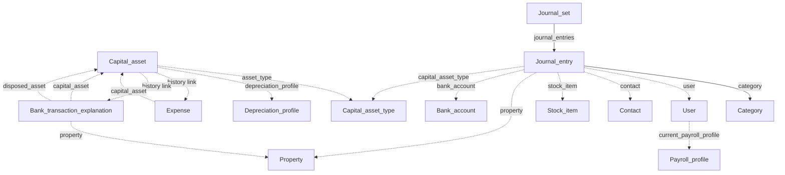

# Assets and journals

Fixed assets, manual journal corrections, landlord properties, and payroll profiles linked to users.

[← Back to entity map hub](../api-entity-map.md)

## Relationship diagram

Capital asset history events may link to an expense, bill, or bank transaction explanation via a `link` URI on each history entry.

## Resource catalogue

| Resource | Official docs | SDK |
|----------|---------------|-----|
| Capital assets | [Capital assets](https://dev.freeagent.com/docs/capital_assets) | Not yet |
| Capital asset types | [Capital asset types](https://dev.freeagent.com/docs/capital_asset_types) | Not yet |
| Depreciation profiles | [Depreciation profiles](https://dev.freeagent.com/docs/depreciation_profiles) | Not yet |
| Journal sets | [Journal sets](https://dev.freeagent.com/docs/journal_sets) | Not yet |
| Properties | [Properties](https://dev.freeagent.com/docs/properties) | Not yet |
| Payroll | [Payroll](https://dev.freeagent.com/docs/payroll) | Not yet |
| Payroll profiles | [Payroll profiles](https://dev.freeagent.com/docs/payroll_profiles) | Not yet |
| CIS bands | [CIS bands](https://dev.freeagent.com/docs/cis_bands) | Not yet |
| CIS settings | [CIS settings](https://dev.freeagent.com/docs/cis_settings) | Not yet |

## Key URI fields

### Capital asset

Mostly self-contained. History entries (`include_history=true`) expose a `link` URI to the purchase or disposal source (expense, bill, or bank explanation).

Created indirectly via expenses or bank explanations with capital categories — not typically a standalone POST on the capital assets endpoint.

### Journal set / journal entry

| Field | Target | When required |
|-------|--------|---------------|
| `category` | Category | Yes |
| `user` | User | User categories |
| `contact` | Contact | Opening balance trade debtors/creditors |
| `stock_item` | Stock item | Stock categories |
| `property` | Property | Landlord P&amp;L categories |
| `capital_asset_type` | Capital asset type | Categories 601–607 |
| `bank_account` | Bank account | Historical only |

Opening balances journal set also embeds `bank_accounts` and `stock_items` arrays with opening values.

### Property

Only for companies of type `UkUnincorporatedLandlord`. Referenced optionally on invoices, expenses, bank explanations, and journal entries in that context.

### User payroll profile

`current_payroll_profile` on user GET is a nested object when payroll is configured — see [Users](https://dev.freeagent.com/docs/users) and [Payroll profiles](https://dev.freeagent.com/docs/payroll_profiles).

## Cross-cluster links

| From cluster | Uses assets/journals |
|--------------|---------------------|
| [Purchases](purchases.md) | Expense `capital_asset` |
| [Banking](banking.md) | Explanation `capital_asset`, `disposed_asset`, `property` |
| [Sales](sales.md) | Invoice `property` (landlord) |
| [Foundations](foundations.md) | Contact CIS fields reference CIS bands by name |

## SDK sequencing note

Journal sets and capital assets sit in **layer 6** of the [hub sequencing table](../api-entity-map.md#using-this-map-to-sequence-sdk-work). They depend heavily on [Categories](foundations.md) and benefit from [Users](foundations.md), [Contacts](foundations.md), and banking/expense flows for realistic probes.
