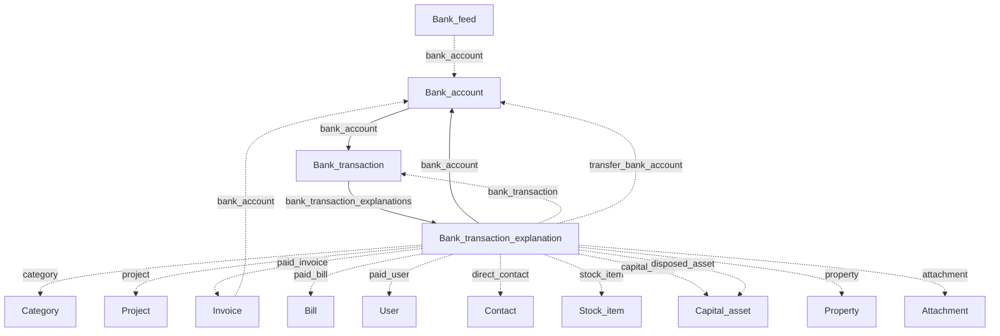

# Banking

Bank accounts, imported transactions, and explanations that categorise movements and link to invoices, bills, and other resources.

[← Back to entity map hub](../api-entity-map.md)

## Relationship diagram

Explanation type determines which URI fields are required (payment, invoice receipt, bill payment, transfer, stock, capital asset, and others). The diagram shows all documented URI targets.

## Resource catalogue

| Resource | Official docs | SDK |
|----------|---------------|-----|
| Bank accounts | [Bank accounts](https://dev.freeagent.com/docs/bank_accounts) | Not yet |
| Bank transactions | [Bank transactions](https://dev.freeagent.com/docs/bank_transactions) | Not yet |
| Bank transaction explanations | [Bank transaction explanations](https://dev.freeagent.com/docs/bank_transaction_explanations) | Not yet |
| Bank feeds | [Bank feeds](https://dev.freeagent.com/docs/bank_feeds) | Not yet |

## Key URI fields

### Bank transaction

| Field | Target | Required? |
|-------|--------|-----------|
| `bank_account` | Bank account | Yes (list and statement upload) |
| `bank_transaction_explanations` | Explanations | Nested array on GET |

List requires: `?bank_account=https://api.freeagent.com/v2/bank_accounts/:id`

### Bank transaction explanation

| Field | Target | When required |
|-------|--------|---------------|
| `bank_account` | Bank account | Create without existing transaction |
| `bank_transaction` | Bank transaction | Create against existing transaction |
| `category` | Category | Most explanation types |
| `project` | Project | Payment / refund rebilling |
| `paid_invoice` | Invoice | Invoice receipt / credit note refund |
| `paid_bill` | Bill | Bill payment / refund |
| `paid_user` | User | Money paid to / received from user |
| `direct_contact` | Contact | Opening balance debtor/creditor categories |
| `transfer_bank_account` | Bank account | Transfers between accounts |
| `stock_item` | Stock item | Purchase / sale of stock |
| `capital_asset` | Capital asset | Read-only on purchase |
| `disposed_asset` | Capital asset | Capital asset disposal |
| `property` | Property | Landlord P&amp;L categories |
| `linked_transfer_explanation` | Explanation | Paired transfer |
| `linked_transfer_account` | Bank account | Paired transfer |

List requires: `?bank_account=`

### Invoice remittance

Invoices may reference `bank_account` for remittance advice — see [Sales](sales.md).

## API version note

From 1 December 2026, bank transaction explanations will return an `attachments` array instead of a singular `attachment`. Use `X-Api-Version: 2026-09-01` to adopt the new behaviour early. See [bank transactions](https://dev.freeagent.com/docs/bank_transactions) and [bank transaction explanations](https://dev.freeagent.com/docs/bank_transaction_explanations).

## SDK sequencing note

Start with **Bank accounts**, then **Bank transactions** (list is scoped to an account), then **Bank transaction explanations**. Typed services for [Invoices](sales.md), [Bills](purchases.md), and [Categories](foundations.md) improve explanation probes but are not required to model the explanation resource itself.
