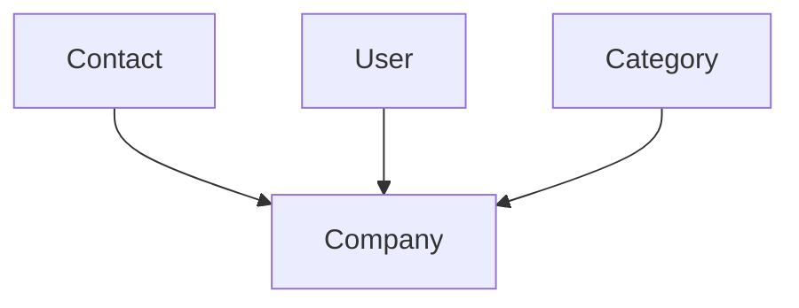

# Foundations

Core company context and reference data that many other resources point at.

[← Back to entity map hub](../api-entity-map.md)

## Relationship diagram

`Company` is the root context for the authenticated account. `Contact` and `User` belong to the company but do not carry a `company` URI on their attributes — the relationship is implicit via the API token. `Categories` are company-scoped chart-of-accounts entries.

`Currencies` appear as ISO code strings (for example `GBP`, `EUR`) on projects, invoices, and bank accounts — not as URI references.

## Resource catalogue

| Resource | Official docs | SDK |
|----------|---------------|-----|
| Company | [Company](https://dev.freeagent.com/docs/company) | [Implemented](../../reference/api-coverage.md#company) |
| Contacts | [Contacts](https://dev.freeagent.com/docs/contacts) | [Implemented](../../reference/api-coverage.md#contacts) |
| Users | [Users](https://dev.freeagent.com/docs/users) | Not yet |
| Categories | [Categories](https://dev.freeagent.com/docs/categories) | [Implemented](../../reference/api-coverage.md#categories) |
| Currencies | [Currencies](https://dev.freeagent.com/docs/currencies) | [Enum support](../../reference/api-coverage.md#currencies-reference-enum) (`CurrencyCode`; no REST resource) |
| Email addresses | [Email addresses](https://dev.freeagent.com/docs/email_addresses) | [Implemented](../../reference/api-coverage.md#email-addresses) |

## Documented URI links from other clusters

Resources elsewhere that point **into** this cluster:

| From | Field | To | Required? |
|------|-------|-----|-----------|
| Project | `contact` | Contact | Yes (create) |
| Invoice | `contact` | Contact | Yes (create) |
| Estimate | `contact` | Contact | Yes (create) |
| Bill | `contact` | Contact | Yes (create) |
| Credit note | `contact` | Contact | Yes (create) |
| Recurring invoice | `contact` | Contact | Yes (create) |
| Expense | `user` | User | Yes (create) |
| Timeslip | `user` | User | Yes (create) |
| Invoice item | `category` | Category | Optional |
| Estimate item | `category` | Category | Optional |
| Bill item | `category` | Category | Optional |
| Bank transaction explanation | `category` | Category | Optional |
| Bank transaction explanation | `paid_user` | User | Yes (money paid to/from user) |
| Bank transaction explanation | `direct_contact` | Contact | Optional (opening balance categories) |
| Journal entry | `category` | Category | Yes |
| Journal entry | `user` | User | Conditional (user categories) |
| Journal entry | `contact` | Contact | Optional (opening balance trade debtors/creditors) |
| Stock item | `cost_of_sale_category` | Category | Read-only attribute |

## Access levels

From the [introduction](https://dev.freeagent.com/docs/introduction): contacts need at least **Time** (extended fields at **Contacts & Projects**); users need **Tax, Accounting & Users** for full CRUD; categories are typically read alongside accounting operations.
