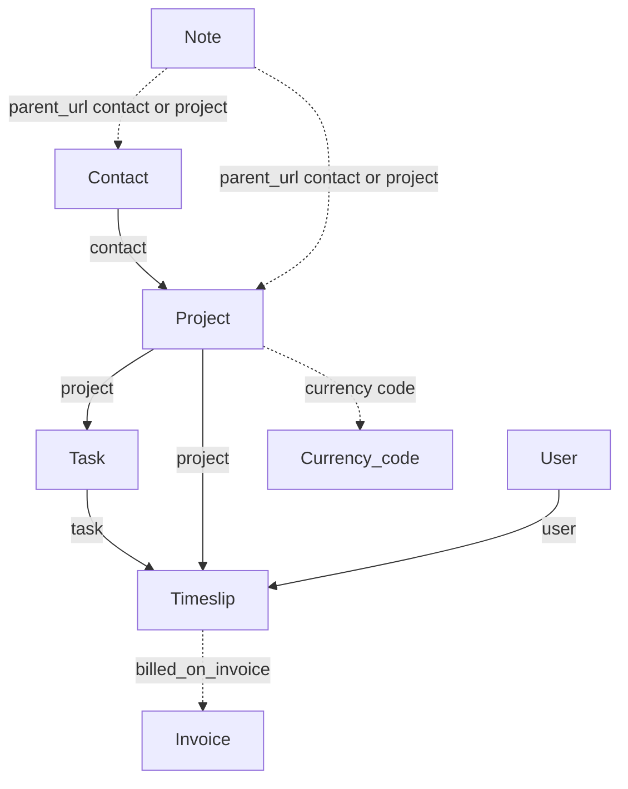

# Projects and time

Client work structure: projects billed to contacts, tasks within projects, time logged against tasks, and notes on contacts or projects.

[← Back to entity map hub](../api-entity-map.md)

## Relationship diagram

Solid arrows are required URIs on create. Dashed arrows are optional or set after billing.

## Resource catalogue

| Resource | Official docs | SDK |
|----------|---------------|-----|
| Projects | [Projects](https://dev.freeagent.com/docs/projects) | Not yet |
| Tasks | [Tasks](https://dev.freeagent.com/docs/tasks) | Not yet |
| Timeslips | [Timeslips](https://dev.freeagent.com/docs/timeslips) | Not yet |
| Notes | [Notes](https://dev.freeagent.com/docs/notes) | Not yet |

## Key URI fields

### Project

| Field | Target | Required on create? |
|-------|--------|---------------------|
| `contact` | Contact | Yes |

List filter: `?contact=https://api.freeagent.com/v2/contacts/:id`

### Task

| Field | Target | Required on create? |
|-------|--------|---------------------|
| `project` | Project | Yes (via `POST /tasks?project=:project`) |

List filter: `?project=https://api.freeagent.com/v2/projects/:id`

### Timeslip

| Field | Target | Required on create? |
|-------|--------|---------------------|
| `task` | Task | Yes |
| `user` | User | Yes |
| `project` | Project | Yes |
| `billed_on_invoice` | Invoice | Read-only when billed |

List filters: `?user=`, `?task=`, `?project=`

### Note

| Field | Target | Required on create? |
|-------|--------|---------------------|
| `parent_url` | Contact or Project | Set by API from query param |

List requires parent: `?contact=` or `?project=`

## Links to other clusters

| From | Field | To cluster | Notes |
|------|-------|------------|-------|
| Timeslip | `billed_on_invoice` | [Sales](sales.md) | Set when time is invoiced |
| Project | `contact` | [Foundations](foundations.md) | Billing contact |
| Timeslip | `user` | [Foundations](foundations.md) | Who logged time |

Projects also receive optional links from invoices, estimates, bills, expenses, and bank explanations — see [Sales](sales.md) and [Purchases](purchases.md).

## SDK sequencing note

Implement **Projects** before **Tasks** and **Timeslips**. **Users** ([Foundations](foundations.md)) should precede timeslips and expenses. **Invoices** are not required to create a timeslip, but `billed_on_invoice` only appears once billing happens.
