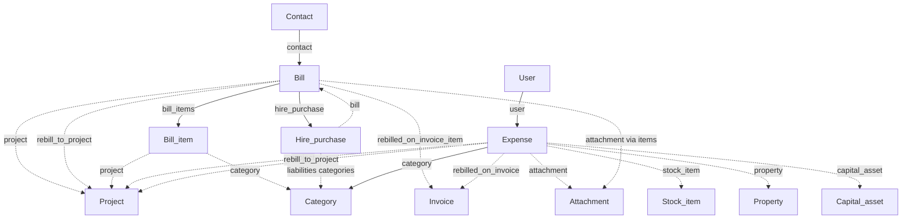

# Purchases

Supplier-facing documents and employee costs: bills, expenses, hire purchases, and file attachments on those records.

[← Back to entity map hub](../api-entity-map.md)

## Relationship diagram

Hire purchases are created via the Bills API and exposed as a read-only resource linked back to the originating bill.

## Resource catalogue

| Resource | Official docs | SDK |
|----------|---------------|-----|
| Bills | [Bills](https://dev.freeagent.com/docs/bills) | Not yet |
| Expenses | [Expenses](https://dev.freeagent.com/docs/expenses) | Not yet |
| Hire purchases | [Hire purchases](https://dev.freeagent.com/docs/hire_purchases) | Not yet |
| Attachments | [Attachments](https://dev.freeagent.com/docs/attachments) | Not yet |

## Key URI fields

### Bill

| Field | Target | Required on create? |
|-------|--------|---------------------|
| `contact` | Contact | Yes |
| `project` | Project | No |
| `rebill_to_project` | Project | No (same as `project` when rebilling) |
| `rebilled_on_invoice_item` | Invoice | Read-only when rebilled |

Bill items may set `project` and `category`.

List filters: `?contact=`, `?project=`

### Expense

| Field | Target | Required on create? |
|-------|--------|---------------------|
| `user` | User | Yes |
| `category` | Category | Yes (or `Mileage` string) |
| `project` | Project | No |
| `rebill_to_project` | Project | No |
| `rebilled_on_invoice` | Invoice | Read-only when rebilled |
| `stock_item` | Stock item | Required when category is purchase of stock |
| `property` | Property | Landlord companies only |
| `capital_asset` | Capital asset | Read-only on capital purchases |

List filter: `?project=`

### Hire purchase

Read-only. Links to the source `bill` and liability `category` URIs.

### Attachment

Polymorphic: nested on expenses, bank transaction explanations, and other resources. Fetched by ID via `GET /attachments/:id`. Access level matches the parent resource.

## Cross-cluster links

| To cluster | Relationship |
|------------|--------------|
| [Sales](sales.md) | `rebilled_on_invoice` / `rebilled_on_invoice_item` when costs are passed through to a client invoice |
| [Foundations](foundations.md) | `contact`, `user`, `category` |
| [Projects and time](projects-and-time.md) | Optional `project` for rebilling |
| [Assets and journals](assets-and-journals.md) | `capital_asset` on capital purchases |
| [Banking](banking.md) | Bill payment explanations use `paid_bill` |

## SDK sequencing note

**Bills** require [Contacts](foundations.md). **Expenses** require [Users](foundations.md) and [Categories](foundations.md). Rebilling fields matter only after [Invoices](sales.md) exist.
