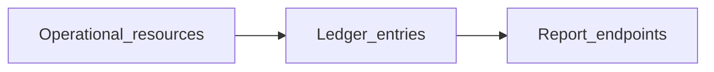

# Reports

Read-only accounting and tax reports. These endpoints are mostly **date-bounded queries** with few URI links between resources, so they are catalogued here rather than drawn as a large relationship diagram.

[← Back to entity map hub](../api-entity-map.md)

## Why this cluster is different

Report resources aggregate ledger data for a period. They do not typically expose create/update/delete flows or require parent URIs on list. Relationships to operational resources (contacts, projects, categories) are implicit in the underlying transactions, not as REST links on the report response.

Use the [Foundations](foundations.md), [Sales](sales.md), [Purchases](purchases.md), and [Banking](banking.md) clusters to understand where report numbers originate.

## Resource catalogue

| Resource | Official docs | SDK | Typical inputs |
|----------|---------------|-----|----------------|
| Profit &amp; loss | [Profit &amp; loss](https://dev.freeagent.com/docs/profit_and_loss) | Not yet | Date range |
| Balance sheet | [Balance sheet](https://dev.freeagent.com/docs/balance_sheet) | Not yet | As-of date |
| Trial balance | [Trial balance](https://dev.freeagent.com/docs/trial_balance) | Not yet | Date range |
| Cashflow | [Cashflow](https://dev.freeagent.com/docs/cashflow) | Not yet | Date range |
| Transactions | [Transactions](https://dev.freeagent.com/docs/transactions) | Not yet | Date range, category filters |
| VAT returns | [VAT returns](https://dev.freeagent.com/docs/vat_returns) | Not yet | Period |
| Sales tax | [Sales tax](https://dev.freeagent.com/docs/sales_tax) | Not yet | Configuration / periods |
| Sales tax periods | [Sales tax periods](https://dev.freeagent.com/docs/sales_tax_periods) | Not yet | Period |
| Corporation tax returns | [Corporation tax returns](https://dev.freeagent.com/docs/corporation_tax_returns) | Not yet | Period |
| Income tax returns | [Income tax returns](https://dev.freeagent.com/docs/income_tax_returns) | Not yet | Period |
| Self assessment returns | [Self assessment returns](https://dev.freeagent.com/docs/self_assessment_returns) | Not yet | Period |
| Final accounts reports | [Final accounts reports](https://dev.freeagent.com/docs/final_accounts_reports) | Not yet | Period |

## Loose relationships (conceptual)

Operational resources (invoices, bills, expenses, bank explanations, journal sets) post to categories. Reports read aggregated category balances — there is no `GET /profit_and_loss?invoice=` style URI graph in the public API.

## Access levels

Most report endpoints require **Tax, Accounting & Users** (level 7) or **Full** (level 8). Confirm the minimum access level on each official docs page before scoping OAuth permissions for an integration.

## SDK sequencing note

Reports belong in **layer 7** — implement after the operational clusters that feed the ledger. [Company](foundations.md) tax timeline may complement VAT and corporation tax work but does not replace these report endpoints.

## Related operational resources

If you need URI-linked data rather than aggregates, prefer:

- [Categories](foundations.md) — chart of accounts
- [Journal sets](assets-and-journals.md) — manual adjustments
- [Bank transaction explanations](banking.md) — cash movements with category and project links
