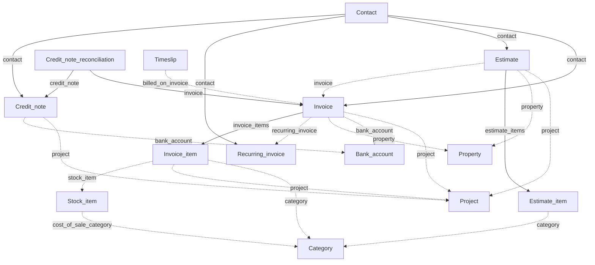

# Sales

Customer-facing documents: invoices, estimates, recurring invoices, credit notes, and stock referenced on invoice lines.

[← Back to entity map hub](../api-entity-map.md)

## Relationship diagram

Invoice items and credit note items are nested on their parent resource pages (no separate top-level docs URL for invoice items). Estimate items have a dedicated endpoint.

## Resource catalogue

| Resource | Official docs | SDK |
|----------|---------------|-----|
| Invoices | [Invoices](https://dev.freeagent.com/docs/invoices) | Not yet |
| Estimates | [Estimates](https://dev.freeagent.com/docs/estimates) | Not yet |
| Recurring invoices | [Recurring invoices](https://dev.freeagent.com/docs/recurring_invoices) | Not yet |
| Credit notes | [Credit notes](https://dev.freeagent.com/docs/credit_notes) | Not yet |
| Credit note reconciliations | [Credit note reconciliations](https://dev.freeagent.com/docs/credit_note_reconciliations) | Not yet |
| Stock items | [Stock items](https://dev.freeagent.com/docs/stock_items) | Not yet |
| Price list items | [Price list items](https://dev.freeagent.com/docs/price_list_items) | Not yet |

## Key URI fields

### Invoice

| Field | Target | Required on create? |
|-------|--------|---------------------|
| `contact` | Contact | Yes |
| `project` | Project | No |
| `bank_account` | Bank account | No |
| `property` | Property | No (landlord companies only) |
| `recurring_invoice` | Recurring invoice | Read-only when generated |

Invoice items (`item_type` includes Hours, Expenses, Bills, Stock, and others) may set `category`, `project`, and `stock_item`.

List filters: `?contact=`, `?project=`

### Estimate

| Field | Target | Required on create? |
|-------|--------|---------------------|
| `contact` | Contact | Yes |
| `project` | Project | No |
| `property` | Property | No (landlord companies only) |

List filters: `?contact=`, `?project=`, `?invoice=` (estimates linked to an invoice)

### Recurring invoice

Inherits invoice attributes plus scheduling fields. Requires `contact` on create.

List filter: `?contact=`

### Credit note

| Field | Target | Required on create? |
|-------|--------|---------------------|
| `contact` | Contact | Yes |
| `project` | Project | No |
| `bank_account` | Bank account | No |

List filters: `?contact=`, `?project=`

### Credit note reconciliation

| Field | Target | Required on create? |
|-------|--------|---------------------|
| `invoice` | Invoice | Yes |
| `credit_note` | Credit note | Yes |

## Cross-cluster inbound links

Resources in other clusters that point **to** invoices:

| From cluster | Resource | Field |
|--------------|----------|-------|
| Projects and time | Timeslip | `billed_on_invoice` |
| Purchases | Bill | `rebilled_on_invoice_item` |
| Purchases | Expense | `rebilled_on_invoice` |
| Banking | Bank transaction explanation | `paid_invoice` (invoice receipt / credit note refund) |

## SDK sequencing note

**Invoices** need only [Contacts](foundations.md) on create. [Categories](foundations.md) is already implemented for line-item `category` URIs. Optionally add [Projects](projects-and-time.md) and [Bank accounts](banking.md) before or in parallel. Credit notes and reconciliations logically follow invoices.
