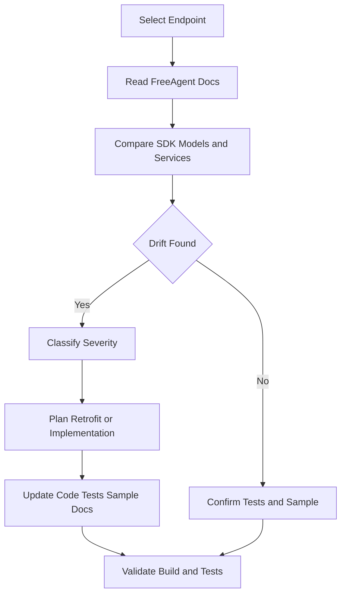

# API to SDK Alignment

## Goal

Keep the SDK aligned with implemented FreeAgent API behaviour, with a repeatable process for detecting and fixing drift.

## Non-Goal

This document does not replicate FreeAgent API reference pages.

## Source of Truth Model

Use these sources in order:

1. FreeAgent API docs for endpoint contract and field semantics.
2. SDK code for implemented behaviour.
3. SDK tests for expected contract behaviour.
4. Sample app for real usage of implemented endpoints.

Any mismatch across these sources is drift.

## Drift Detection Workflow

Per endpoint:

1. Confirm endpoint and payload shape against FreeAgent docs.
2. Compare model field types and wrappers with [plan/API_TYPE_MAPPING_POLICY.md](API_TYPE_MAPPING_POLICY.md).
3. Compare service behaviour, pagination, and payload guards.
4. Confirm tests cover mapping, envelope handling, errors, and pagination.
5. Confirm sample app page and navigation reflect current implementation.
6. Record and classify drift before implementing changes.

## Drift Severity Matrix

| Drift Type | Severity | Typical Action |
|---|---|---|
| Missing endpoint implementation | High | Implement endpoint or explicitly mark out of scope |
| Type mismatch against mapping policy | High | Retrofit model and tests |
| Wrapper or payload guard mismatch | High | Fix service and tests |
| Sample app out of sync with SDK | Medium | Update sample pages and navigation |
| Test gaps for implemented behaviour | Medium | Add tests before merge |
| Documentation wording mismatch | Low | Update docs |

## Audit Cadence

- Per endpoint PR: targeted drift check.
- Before release: full pass on all implemented endpoints.
- After notable FreeAgent API changes: targeted re-audit.

## Handling Intentional Deviations

1. Record the deviation and rationale in the PR.
2. Update [plan/API_TYPE_MAPPING_POLICY.md](API_TYPE_MAPPING_POLICY.md) when policy-level change is intended.
3. Add or update tests to lock in intentional behaviour.
4. Ensure sample app and docs reflect the chosen behaviour.

## Alignment Workflow

## Implementation Notes

Use this document together with:

- [plan/IMPLEMENTING_ENDPOINTS.md](IMPLEMENTING_ENDPOINTS.md)
- [plan/API_TYPE_MAPPING_POLICY.md](API_TYPE_MAPPING_POLICY.md)

Together they define how endpoint work is planned, validated, and kept aligned over time.
