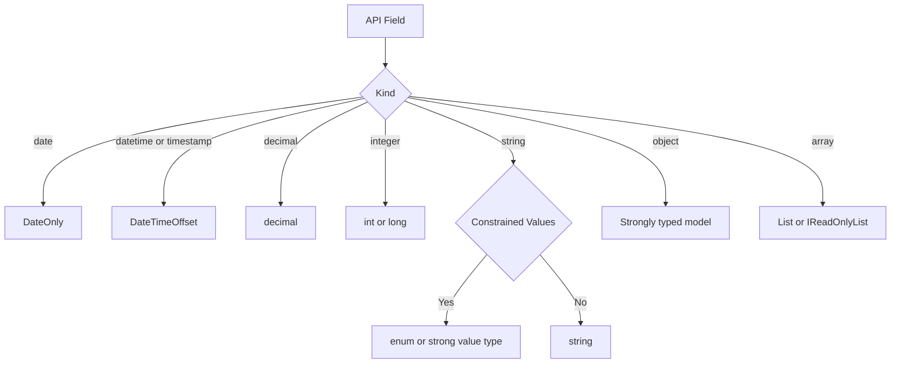

# API Type Mapping Policy

Status: Active
Scope: All FreeAgent.NET SDK model types and endpoint contracts
Precedence: This policy supersedes ad-hoc mapping decisions. Deviations require explicit review.

## Purpose

Use this policy to keep FreeAgent API attribute mapping consistent for humans and AI agents.

This reduces model drift, avoids repeated type debates, and supports the project goals in [plan/PROJECT-KICKOFF-SPEC.md](PROJECT-KICKOFF-SPEC.md), especially the risk of API change over time.

## Canonical Mapping Table

| API Kind | Preferred .NET Type | Rationale | Exceptions and Notes |
|---|---|---|---|
| string (constrained set) | enum | Type safety, discoverability, predictable usage | If values are clearly unstable, use strong value type or string with documented rationale |
| string (free text) | string | Direct mapping, low friction | Consider strong value type when reused across many models |
| integer | int | Default numeric mapping | Use long only when the documented range needs it |
| decimal or currency | decimal | Precision for money and rates | Do not use float or double |
| date (YYYY-MM-DD) | DateOnly | No time component on wire | Do not use DateTime |
| datetime or timestamp (ISO 8601) | DateTimeOffset | Offset-aware and unambiguous | Do not use DateTime |
| boolean | bool | Direct mapping | Use bool? when API field is optional |
| array | IReadOnlyList<T> or List<T> | Collection semantics | Follow existing repo convention for the specific model area |
| object | Strongly typed model | Predictable contracts | Use JsonExtensionData only for intentionally open-ended data |

## Constrained String Policy

1. Use enum for stable, closed sets documented by FreeAgent.
2. Use strong value type when values are structured but may expand.
3. Use string only when stability is unknown, and document the reason.
4. API-facing enums must use explicit wire values via `JsonStringEnumMemberName` on every enum member.
5. Do not rely on implicit enum member name serialisation for wire contracts.

Example retrofit targets:

- Company Currency: string to CurrencyCode enum.
- Company Type: string to CompanyType enum.
- Company MileageUnits: string to MileageUnit enum.

## Date and Time Policy

1. API values shaped like 2026-05-01 map to DateOnly.
2. API values with time and offset map to DateTimeOffset.
3. DateTime is not used for API-facing model properties.

Wire format expectations:

- DateOnly: yyyy-MM-dd
- DateTimeOffset: ISO 8601 timestamp with offset

## Wrapper and Null Guard Policy

1. Use explicit envelope types for API responses.
2. Validate required payload branches in services.
3. Throw FreeAgentApiException when required branches are missing.
4. Use nullable types only where the API contract is optional.

## Compatibility Guidance

Pre-GA:

- Breaking changes are allowed when they improve correctness.
- Call out mapping breaks explicitly in PR notes and docs.

Post-GA:

- Breaking mapping changes require major versioning and migration notes.

## Endpoint Implementation and Retrofit Checklist

- [ ] Mapped each API field kind using the canonical table.
- [ ] Converted date-only fields to DateOnly.
- [ ] Converted constrained strings to enum or strong value type where appropriate.
- [ ] Confirmed wrapper models exist and are validated.
- [ ] Added or updated tests for wire mapping and parsing behaviour.
- [ ] Updated sample app when endpoint behaviour changed.
- [ ] Documented any intentional deviations.

## Handling API Changes and Deviations

1. Raise an issue when API docs or behaviour changes.
2. Classify impact on model types, services, tests, and sample app.
3. Update this policy when a mapping rule changes.
4. Keep a short rationale for each intentional deviation in code comments or docs.

When documentation is ambiguous:

1. Prefer conservative typing and mark the field as unresolved in the implementation output.
2. Do not silently guess constrained values.
3. Capture a follow-up issue with expected validation work.

## Mapping Decision Flow

